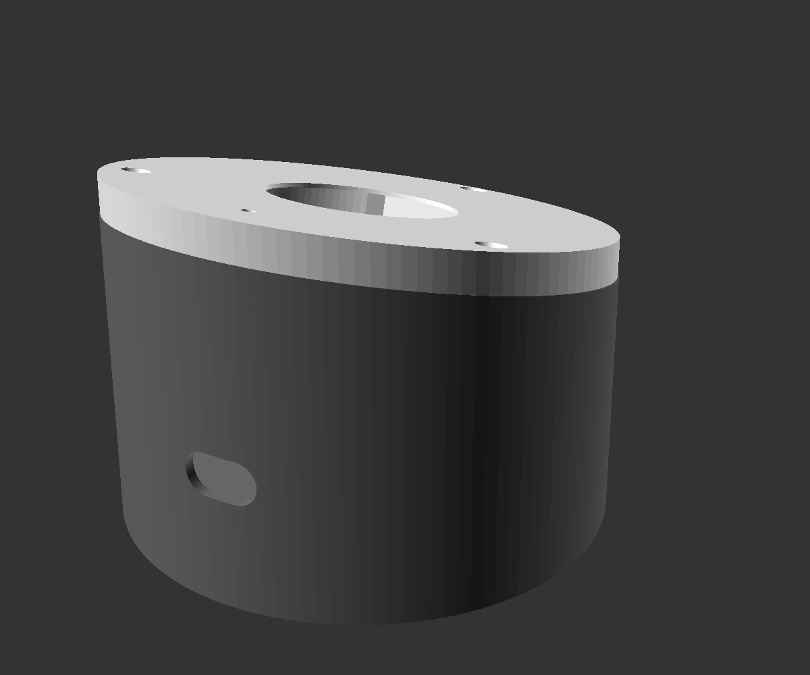
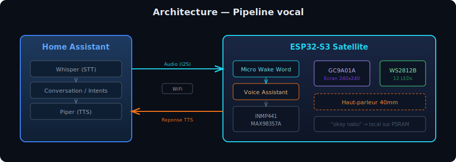
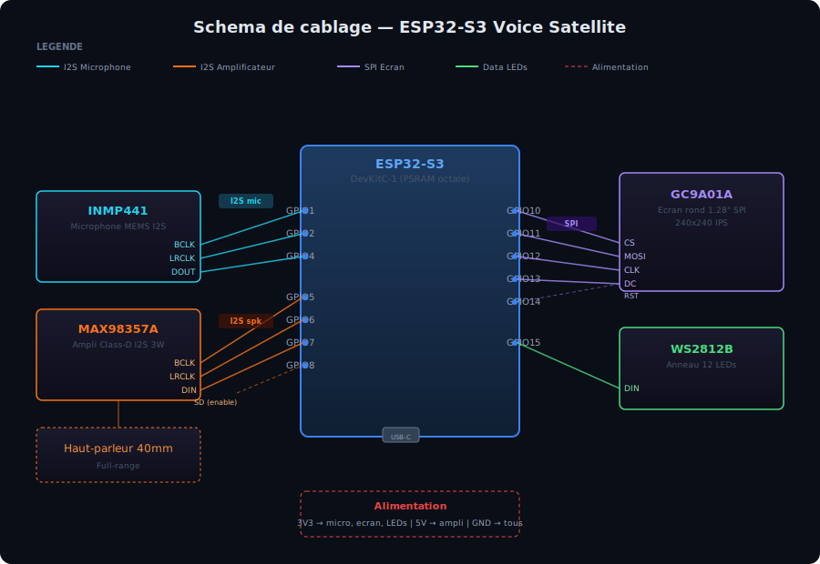
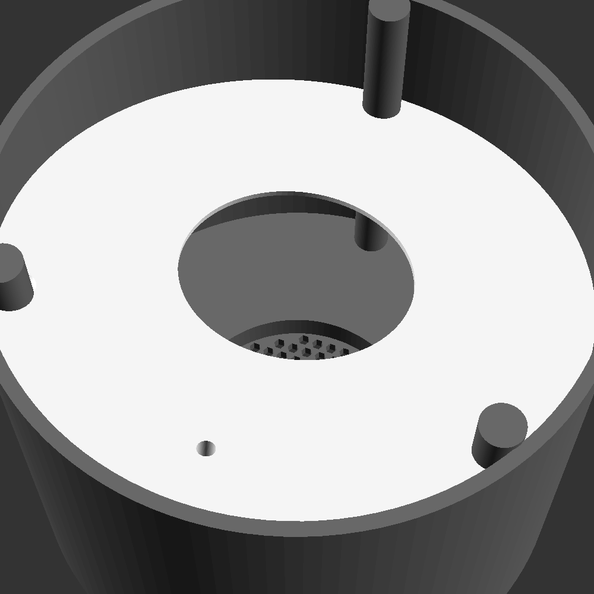
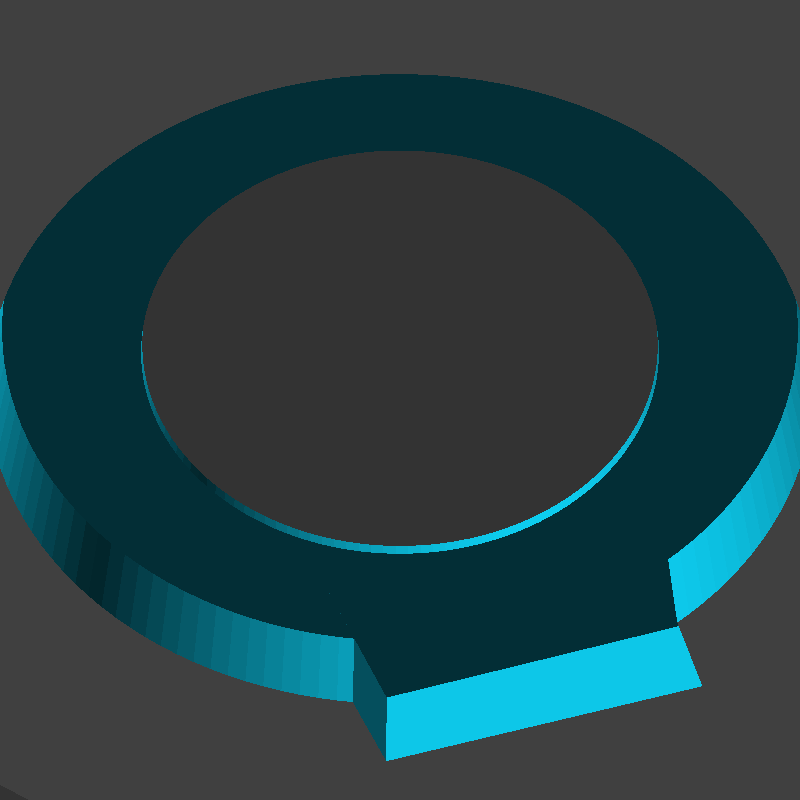
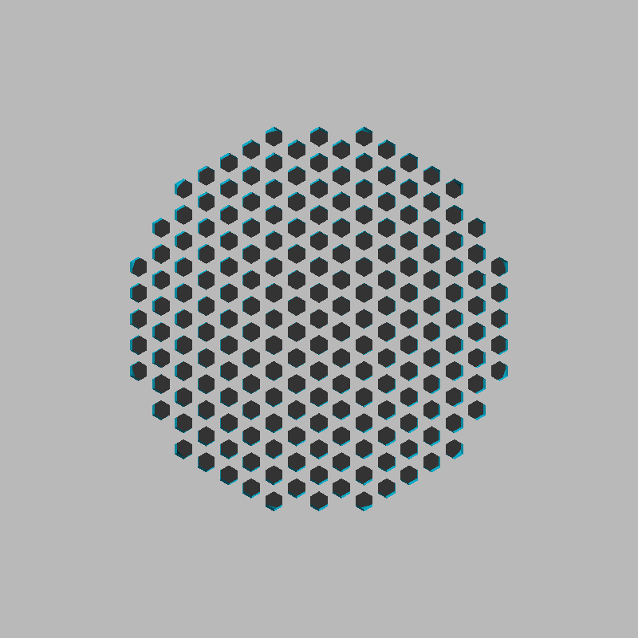

# Satellite vocal ESP32-S3

Un satellite vocal Home Assistant entierement local, construit autour d'un ESP32-S3 avec ecran LCD rond, anneau LED et un boitier imprime en 3D incline — le tout configure sous ESPHome.

<p align="center">
  
</p>

---

## Architecture

<p align="center">
  
</p>

Le micro ecoute en permanence le mot de reveil ("okay nabu") **localement** sur la PSRAM de l'ESP32-S3. Une fois detecte, l'audio est transmis via WiFi a Home Assistant qui gere la reconnaissance vocale (Whisper), le traitement d'intentions et la synthese vocale (Piper). La reponse audio est renvoyee au satellite et jouee par le haut-parleur.

---

## Materiel

### Liste des composants

| Composant | Reference | Lien | Notes |
|---|---|---|---|
| MCU | ESP32-S3-DevKitC-1 | [AliExpress](https://www.aliexpress.com/item/1005008796158734.html) | Doit avoir une PSRAM octale (pour le wake word local) |
| Microphone | INMP441 (module MH-ET LIVE) | [AliExpress](https://www.aliexpress.com/item/1005006109471759.html) | Micro MEMS I2S omnidirectionnel, canal gauche |
| Amplificateur | MAX98357A | [AliExpress](https://www.aliexpress.com/item/1005007003802663.html) | Ampli I2S Class-D mono 3W |
| Haut-parleur | 40 mm full-range | [AliExpress](https://www.aliexpress.com/item/1005010726060483.html) | Encastre en press-fit dans la base |
| Anneau LED | WS2812B, 12 LEDs | [AliExpress](https://www.aliexpress.com/item/1005009796023642.html) | ~50 mm de diametre externe |
| Ecran | GC9A01A, 1.28" rond | [AliExpress](https://www.aliexpress.com/item/1005004482028005.html) | 240x240, SPI, IPS |
| Visserie | 3x vis M3x8 fraisees | — | + 3x inserts M3 a chaud pour le corps |
| Cable | USB-C | — | Alimentation et premier flash |

### Cablage

<p align="center">
  
</p>

<details>
<summary>Brochage en texte</summary>

```
Brochage GPIO ESP32-S3
────────────────────────────────────────────

Microphone INMP441 (bus I2S "i2s_mic")
  BCLK ─── GPIO1
  LRCLK ── GPIO2
  DOUT ─── GPIO4
  L/R ──── GND  (canal gauche)

Amplificateur MAX98357A (bus I2S "i2s_spk")
  BCLK ─── GPIO5
  LRCLK ── GPIO6
  DIN ──── GPIO7
  SD ───── GPIO8  (enable/shutdown, actif haut)

Anneau LED WS2812B
  DIN ──── GPIO15

Ecran rond GC9A01A (SPI)
  CLK ──── GPIO12
  MOSI ─── GPIO11
  CS ───── GPIO10
  DC ───── GPIO13
  RST ──── GPIO14

Alimentation
  3V3 ──── INMP441 VDD, GC9A01A VCC, anneau LED VCC
  5V ───── MAX98357A VIN
  GND ──── tous les GND
```

</details>

---

## Logiciel

Le firmware est un unique fichier YAML ESPHome : [`satellite.yaml`](satellite.yaml).

### Fonctionnalites

- **Wake word local** — Micro Wake Word (`okay_nabu`) sur la PSRAM. Aucun flux audio ne quitte l'appareil tant que le mot de reveil n'est pas detecte.
- **Pipeline vocal** — transmet l'audio a Home Assistant pour STT, traitement d'intentions et TTS.
- **Ecran rond anime** — rendu lambda a 10 fps avec horloge, arcs rotatifs, indicateurs volume/WiFi.
- **Anneau LED** — 12 LEDs adressables avec animations par etat.
- **Son de demarrage** — deux notes ascendantes generees proceduralement (Do5 → Sol5).
- **Volume** — slider 0-100% expose dans HA, persistant entre redemarrages.
- **Audio** — suppression de bruit niveau 4, gain auto 31 dBFS.

### Interface ecran

<p align="center">
  
</p>

L'ecran rond GC9A01A (240x240) affiche une interface de type "cadran spatial" avec :
- **Horloge** numerique synchronisee Home Assistant + date en francais
- **Trois anneaux** d'arcs rotatifs concentriques a vitesses independantes
- **Indicateur de secondes** fluide sur l'anneau exterieur
- **Anneau d'etat** pulsant dont la couleur change selon l'etat VA
- **Volume** (barres + icone haut-parleur) et **WiFi** (arcs) aux extremites

### Effets anneau LED

<p align="center">
  
</p>

### Etats de l'assistant vocal

| Etat | ID | Ecran | Anneau LED | Description |
|---|---|---|---|---|
| Veille | 0 | Horloge + date | Bleu tamisee | En attente du mot de reveil |
| Ecoute | 1 | "Ecoute..." (bleu) | Point bleu tournant | Enregistrement de la parole |
| Traitement | 2 | "Traitement..." (violet) | Onde violette | STT + traitement en cours |
| Parle | 3 | "Parle..." (vert) | Onde verte | Lecture de la reponse TTS |
| Erreur | 4 | "Erreur" (rouge) | Clignotement rouge | Erreur pipeline (3s puis reset) |

### Framework ESPHome

- ESP-IDF (version recommandee)
- PSRAM : mode octal, 80 MHz
- Version ESPHome minimale : 2024.11.0
- Packages partages : [`common/core.yaml`](common/core.yaml) (API, OTA, portail captif), [`common/wifi.yaml`](common/wifi.yaml) (WiFi WPA2 + AP de secours)

---

## Boitier

Le boitier est un design parametrique OpenSCAD ([`../enclosure/satellite.scad`](../enclosure/satellite.scad)) compose de deux pieces imprimees.

<p align="center">
  
  
</p>

### Conception

- **Format** — puck cylindrique de 90 mm de diametre, incline a 15 degres pour orienter l'ecran et le micro vers l'utilisateur
- **Epaisseur de paroi** — 2 mm

**Corps** — coque cylindrique avec grille nid d'abeille, embases inserts M3, collet press-fit haut-parleur, passage USB-C arriere.

**Face** — capot affleurant avec fenetre ecran (34 mm), logement anneau LED (50 mm), port micro, trous fraises M3.

<p align="center">
  
  
  
</p>

<p align="center">
  <em>Corps (interieur) — Face (arriere, logement LED/ecran) — Dessous (grille nid d'abeille)</em>
</p>

### Montage

1. Encastrer le haut-parleur en press-fit dans le collet au fond du corps (ouverture 40 mm)
2. Installer 3x inserts M3 a chaud dans les embases sur la surface inclinee du corps
3. Cabler et fixer l'ESP32-S3 a l'interieur du corps
4. Passer le cable USB-C par la fente arriere (14x8 mm)
5. Monter l'anneau LED et l'ecran dans le logement de la face
6. Fixer la face avec 3x vis M3 fraisees

### Impression

- STL pre-exportes dans [`enclosure/`](../enclosure/) : `body.stl`, `face.stl`, `spk_ring.stl`
- Pour personnaliser, ouvrir `satellite.scad` dans OpenSCAD et changer la variable `part` en `body`, `face` ou `assembly`
- Recommande : PLA ou PETG, hauteur de couche 0.2 mm, remplissage 20%
- Imprimer la face en blanc ou translucide pour diffuser la lumiere de l'anneau LED

### Dimensions cles

| Parametre | Valeur |
|---|---|
| Diametre exterieur | 90 mm |
| Angle d'inclinaison | 15 degres |
| Epaisseur de paroi | 2 mm |
| Diametre haut-parleur | 40 mm |
| Fenetre ecran | 34 mm |
| Anneau LED exterieur | 50 mm |
| Fente cable | 14 x 8 mm |
| Fixation | 3x M3 sur PCD 78 mm |

---

## Flash du firmware

```bash
# Premier flash (USB)
esphome run satellite.yaml

# Mises a jour suivantes (OTA)
esphome run satellite.yaml --device esp-satellite.local
```

## Dependances

- [Home Assistant](https://www.home-assistant.io/) avec un pipeline vocal configure (Whisper STT + Piper TTS recommandes pour un fonctionnement entierement local)
- [ESPHome](https://esphome.io/) 2024.11.0+
- [OpenSCAD](https://openscad.org/) (uniquement pour personnaliser le boitier)

## Licence

Projet personnel partage tel quel. Libre d'utilisation et de modification.
